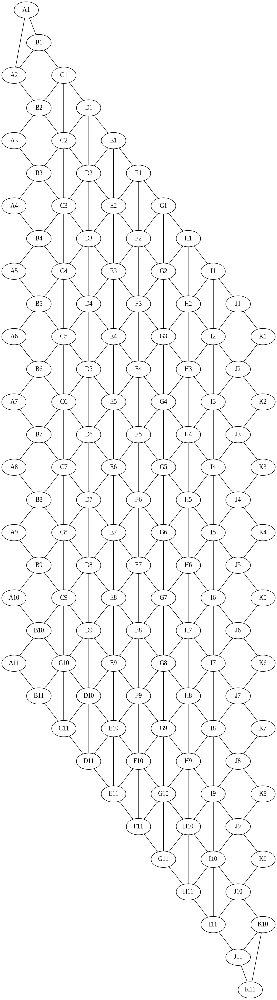

<!-- Mejor compatibilidad --> 

<!-- PROJECT SHIELDS -->
<!-- [![displayed text][displayed image url]][link url] -->

<!-- logo y titulo -->

  
  <h1>Title</h1>
  

    Muy breve descripción del proyecto
  

  
Tabla de contenidos

  <ol>
    <u>
    <li><a href="#acerca-del-proyecto">
      Acerca del proyecto
      <ul>
        <li><a href="#descripción">Descripción</a></li>
        <li><a href="#caracteristicas">Características</a></li>
        <li><a href="#tecnologías">Tecnologías</a></li>
        <li><a href="#temas-de-interes">Temas de interes</a></li>
      </ul>
    </u>
    </a></li>
    <li><a href="#instalacion">
      Instalación
      <ul>
        <li><a href="#requisitos">Requisitos</a></li>
        <li><a href="#pasos-de-instalacion">Pasos de instalación</a></li>
      </ul>
    </a></li>
    <li><a href="#instrucciones-de-uso">
      Instrucciones de uso
    </a></li>
    <li><a href="#licencia">
      Licencia
    </a></li>
    <li><a href="#diagramas">
      Diagramas
      <ul>
        <li><a href="#grafo-del-tablero">Grafo del tablero</a></li>
        <u><li><a href="#diagrama-de-clases">Diagrama de clases</a></li></u>
      </ul>
    </a></li>
    <li><a href="#link-del-video">
      Link del video
    </a></li>
    <li><a href="#autores">
      Autores
    </a></li>
    <li><a href="#referencias-y-links">
      Referencias y links
    </a></li>
  </ol>

---

## Acerca del proyecto

### Descripción

### Características

### Tecnologías

### Temas de interes

- Monte Carlo Tree Search
- Strategy stealing argument
- four color theorem

## Installation

### Requisitos

### Pasos de instalación

## Instrucciones de uso

## Licencia

Distribuido bajo la licencia MIT. Ver [`LICENSE`](LICENSE) para más información.

## Diagramas

### Grafo del tablero

### Diagrama de clases

## Link del video

## Autores

Completar con los nombres completos de los autores

- Allyson
- Mariel
- Noemi
- Leonardo
- Adrian
- Enrique Francisco Flores Teniente

## Referencias y links

- [The Game of Hex: An Automatic Theorem Proving Approach to Game
Programming](https://www.aaai.org/Papers/AAAI/2000/AAAI00-029.pdf)  
  Paper que explica un teorema para analizar posiciones en el juego Hex.  
  Anshelevich, V.V. (2000). The Game of Hex: An Automatic Theorem Proving Approach to Game Programming. AAAI/IAAI.

- [PLAYING AND SOLVING THE GAME OF HEX](https://era.library.ualberta.ca/items/dd8ce116-183f-4ad0-b7e6-618d38f132ff/view/2aadbc49-e39e-4554-ad29-1e2de4d98aab/Henderson-Philip-Fall2010.pdf)  
  Paper extenso que explica a detalle como crear un programa de Hex.  
  Philip Thomas Henderson. 2010. Playing and solving the game of hex. Ph.D. Dissertation. University of Alberta, CAN.

- [MoHex 2.0: a pattern-based MCTS Hex player](https://webdocs.cs.ualberta.ca/~hayward/papers/m2.pdf)  
  Un paper que explica el funcionamiento de MoHex 2.0 (2014), predecesor del actual mejor programa de Hex MoHex3HNN.  
  Huang, SC., Arneson, B., Hayward, R.B., Müller, M., Pawlewicz, J. (2014). MoHex 2.0: A Pattern-Based MCTS Hex Player. In: van den Herik, H., Iida, H., Plaat, A. (eds) Computers and Games. CG 2013. Lecture Notes in Computer Science(), vol 8427. Springer, Cham.[https://doi.org/10.1007/978-3-319-09165-5_6](https://doi.org/10.1007/978-3-319-09165-5_6)

- [Hex 2018: MoHex3HNN over DeepEzo](https://webdocs.cs.ualberta.ca/~hayward/papers/taiwan18.pdf)  
  Paper que analiza la victoria de MoHex3HNN sobre DeepEzo en uno de los ultimos torneos de programas de Hex.  
  Gao, C., Takada, K., & Hayward, R.B. (2019). Hex 2018: MoHex3HNN over DeepEzo. J. Int. Comput. Games Assoc., 41, 39-42.

- [https://github.com/cgao3/neurobenzene](https://github.com/cgao3/neurobenzene)  
  Repositorio de código de Neurobenzene, Red neuronal usada en MoHex3, incluye un instalable de MoHex3.

---

[Back To The Top](#readme-top)
