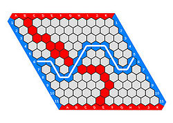
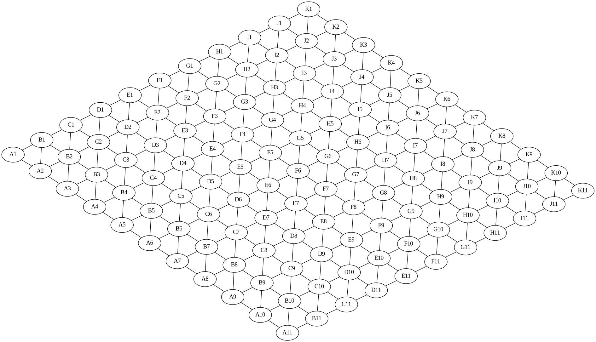
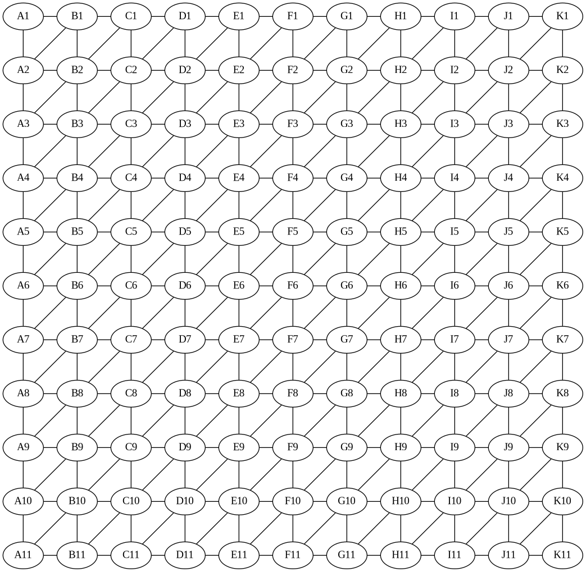

<!-- Mejor compatibilidad --> 
<a name="readme-top"></a>

<!-- PROJECT SHIELDS -->
<!-- [![displayed text][displayed image url]][link url] -->


<!-- logo y titulo -->
<div align="center">
  <a href="https://github.com/CS1103/proyecto-final-grupo-5-1">
    <image src="C:\Users\NOEMI\Pictures\Screenshots\hex_portada.png" alt="Descripción de la imagen">
    
  </a>
  <h1>Chiquis's Hex game</h1>
  
  <p>
  Somos estudiantes del curso de Programación III de la Universidad de Ingeniería y Tecnología de Lima, Perú.  
  Hemos aplicado conocimientos aprendidos durante el curso de Programación para desarrollar un juego de Hex en C++.
  </p>
</div>


<details open>
  <summary>Tabla de contenidos:</summary>
  <ol>
    <u>
    <li><a href="#acerca-del-proyecto">
      Acerca del proyecto
      <ul>
        <li><a href="#descripción">Descripción</a></li>
        <li><a href="#características">Características</a></li>
        <li><a href="#tecnologías">Tecnologías</a></li>
        <li><a href="#temas-de-interés">Temas de interés</a></li>
      </ul>
    </u>
    </a></li>
    <li><a href="#instalación">
      Instalación
      <ul>
        <li><a href="#requisitos">Requisitos</a></li>
        <li><a href="#pasos-de-instalación">Pasos de instalación</a></li>
      </ul>
    </a></li>
    <li><a href="#instrucciones-de-uso">
      Instrucciones de uso
    </a></li>
    <li><a href="#licencia">
      Licencia
    </a></li>
    <li><a href="#diagramas">
      Diagramas
      <ul>
        <li><a href="#grafo-del-tablero">Grafo del tablero-11x11</a></li>
        <u><li><a href="#diagrama-de-clases">Diagrama de clases</a></li></u>
      </ul>
    </a></li>
    <li><a href="#link-del-video">
      Link del video
    </a></li>
    <li><a href="#autores">
      Autores
    </a></li>
    <li><a href="#referencias-y-links">
      Referencias y links
    </a></li>
  </ol>
</details>

---

## Acerca del proyecto

### Descripción
El proyecto consiste en la elaboración del juego Hex tradicional pero con la implementación adicional de nuevas características. El juego tiene como objetivo ser más flexible para el usuario ya que se da la posibilidad de hacer cambios a las características de su juego antes, durante y después de haber sido empezado. Por otro lado, el usuario tiene la opción de elegir dos tipos de tablero uno de 7x7 y el otro de 11x11; además existen dos opciones de juego, contra otro jugador de forma local o contra la computadora. 

### Características
#### Características Principales
- **Swap:** 

  El juego se realiza en un intercambio de un movimiento de una casilla por jugador. El juego no ejecuta ninguna acción si el jugador intenta realizar movimientos durante el turno del otro jugador y esto ocurre en todo el tiempo de partida.

- **Tiempo límite:**

  El juego tiene un tiempo límite de partida sin detención con una duración de --- minutos. Si el juego acaba sin reciir un ganador, los declara a los dos jugadores como partida perdida.

#### Caracteristicas Adicionales
- Juego multiplayer simultáneo
- Bot de múltiples dificultades
- Configuración dinámica del juego

### Tecnologías
- Lenguaje de programación C++17 o posterior
- Graphvz
- Librería GUI

### Temas de interés
- Monte Carlo Tree Search
- Strategy stealing argument
- Four color theorem


## Instalación
### Requisitos
- Sistema Operativo MS Windows (10 u 11)
- Terminal Git Bash
- Compilador g++ v20 

### Pasos de instalación
1. Clonación de repositorio con 
```bash
git clone https://github.com/CS1103/proyecto-final-grupo-5-1
```
3. Ejecutar el instalador
4. Ejecutar el juego Hex

## Instrucciones de uso
### Instrucciones

### Reglas de juego
El juego Hex se lleva a cabo en un tablero de tamaño NxN. Adicionalmente, es jugado por dos jugadores.
 
- Al comienzo de cada partida el tablero está vacío.
- Cada jugador cuenta con fichas de un color, este color no puede ser igual para ambos jugadores. 
- Cada jugador elige con qué color va a jugar y, por tanto, cuáles son los bordes que debe conectar; como los bordes a conectar deben ser opuestos, han de conectarse el noroeste con el sureste para un jugador, y el nordeste con el suroeste para el otro. 
- Los movimientos se harán por turnos alternativos de cada jugador y es una ficha por turno.
- La finalidad del juego es ir formando una hilera de fichas ininterrumpida entre uno de los lados del rombo que es el tablero y el opuesto, uniendo de este modo ambos lados.
- Los jugadores no podrán mover las fichas ya incorporadas.
- Gana el jugador que antes consiga completar la hilera.


## Licencia

Distribuido bajo la licencia MIT. Ver [`LICENSE`](LICENSE) para más información.

## Diagramas

### Grafo del tablero 11x11

<div align="center">  </div>
<br>

- Podemos observar que es posible identificar cada casilla por una letra (A...K) y un número (1...11).
- Se cumple que cada casilla tiene 6 vecinos, excepto las casillas en los bordes del tablero, que tienen 4 y las casillas en las esquinas, que tienen 2.
- Los vecinos de una casilla central X, N son (X, N - 1); (X, N + 1); (X - 1, N); (X - 1, N + 1); (X + 1, N); (X + 1, N - 1).

Si quisieramos utilizar una matriz como contenedor para el tablero, estas serian las relaciónes de la casilla **3,3**

<div align="center">

| _1_ | _2_ | _3_     | _4_ |
|-----|-----|---------|-----|
| _2_ |     | 3,2     | 4,2 |
| _3_ | 2,3 | **3,3** | 4,3 |
| _4_ | 2,4 | 3,4     |     |



</div>


### Diagrama de clases


## Link del video

## Autores
- Allyson Tiphany Sánchez Báez
- Mariel Carolina Tovar Tolentino
- Noemi Alejandra Huarino Anchillo
- Leonardo Daniel Isidro Salazar
- Adrian Sandoval Huamaní
- Enrique Francisco Flores Teniente

## Referencias y links

- [The Game of Hex: An Automatic Theorem Proving Approach to Game
Programming](https://www.aaai.org/Papers/AAAI/2000/AAAI00-029.pdf)  
  Paper que explica un teorema para analizar posiciones en el juego Hex.  
  Anshelevich, V.V. (2000). The Game of Hex: An Automatic Theorem Proving Approach to Game Programming. AAAI/IAAI.

- [PLAYING AND SOLVING THE GAME OF HEX](https://era.library.ualberta.ca/items/dd8ce116-183f-4ad0-b7e6-618d38f132ff/view/2aadbc49-e39e-4554-ad29-1e2de4d98aab/Henderson-Philip-Fall2010.pdf)  
  Paper extenso que explica a detalle como crear un programa de Hex.  
  Philip Thomas Henderson. 2010. Playing and solving the game of hex. Ph.D. Dissertation. University of Alberta, CAN.

- [MoHex 2.0: a pattern-based MCTS Hex player](https://webdocs.cs.ualberta.ca/~hayward/papers/m2.pdf)  
  Un paper que explica el funcionamiento de MoHex 2.0 (2014), predecesor del actual mejor programa de Hex MoHex3HNN.  
  Huang, SC., Arneson, B., Hayward, R.B., Müller, M., Pawlewicz, J. (2014). MoHex 2.0: A Pattern-Based MCTS Hex Player. In: van den Herik, H., Iida, H., Plaat, A. (eds) Computers and Games. CG 2013. Lecture Notes in Computer Science(), vol 8427. Springer, Cham.[https://doi.org/10.1007/978-3-319-09165-5_6](https://doi.org/10.1007/978-3-319-09165-5_6)

- [Hex 2018: MoHex3HNN over DeepEzo](https://webdocs.cs.ualberta.ca/~hayward/papers/taiwan18.pdf)  
  Paper que analiza la victoria de MoHex3HNN sobre DeepEzo en uno de los ultimos torneos de programas de Hex.  
  Gao, C., Takada, K., & Hayward, R.B. (2019). Hex 2018: MoHex3HNN over DeepEzo. J. Int. Comput. Games Assoc., 41, 39-42.

- [https://github.com/cgao3/neurobenzene](https://github.com/cgao3/neurobenzene)  
  Repositorio de código de Neurobenzene, Red neuronal usada en MoHex3, incluye un instalable de MoHex3.


## Convenciones

#### Naming conventions

- clases = PascalCaseName
- methods = camelCaseName
- constants = CONSTANT_VARIABLE
- variables = simple_variable_name
- functions = VerbPascalCase (start with verb)
  - function parameters = camelCaseParameter

- prepending variables (optional):
  - attribute = m_... (class member)
  - pointers = p_...
  - reference = r_...
  - constants = c_...

#### Header token definition

```cpp
#ifndef PASCALCASENAME_H
#define PASCALCASENAME_H

class PascalCaseName{

private:

protected:

public:

};

#endif // !PASCALCASENAME_H
```

#### Siempre seguir la regla de 0 (Propuesta)

```
- You should NEVER implement a destructor, copy constructor, move constructor or assignment operators in your code.
- You should NEVER use a raw pointer to manage a resource.

```


---

[Back To The Top](#readme-top)
